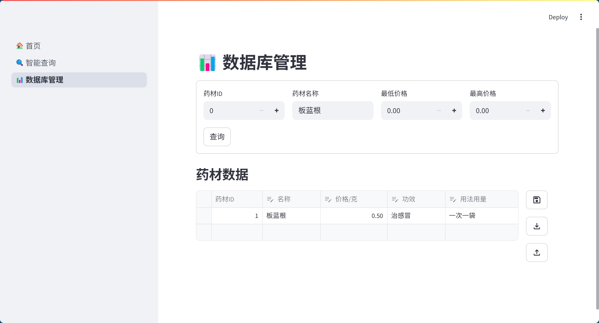
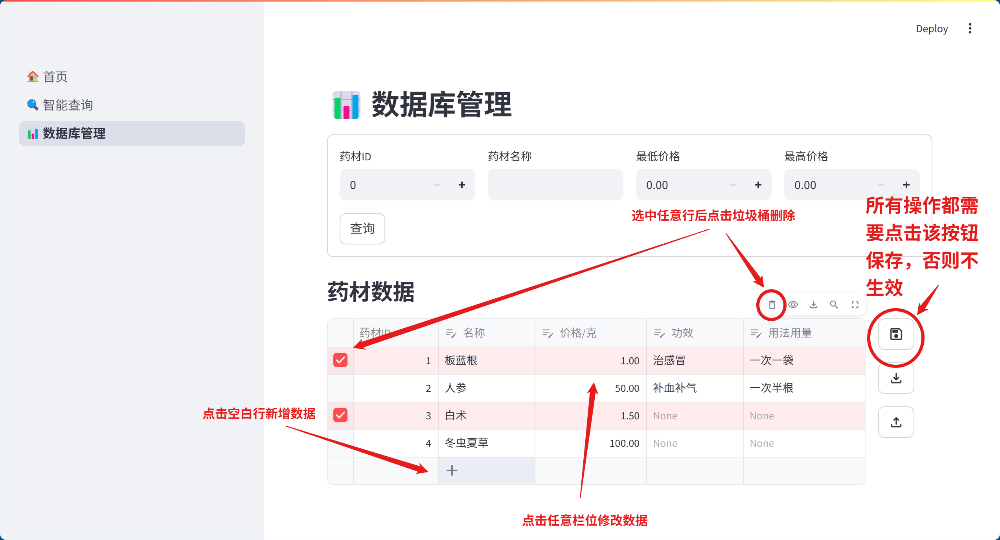
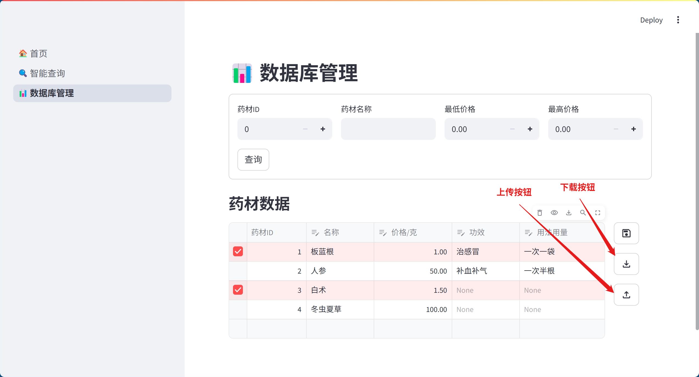
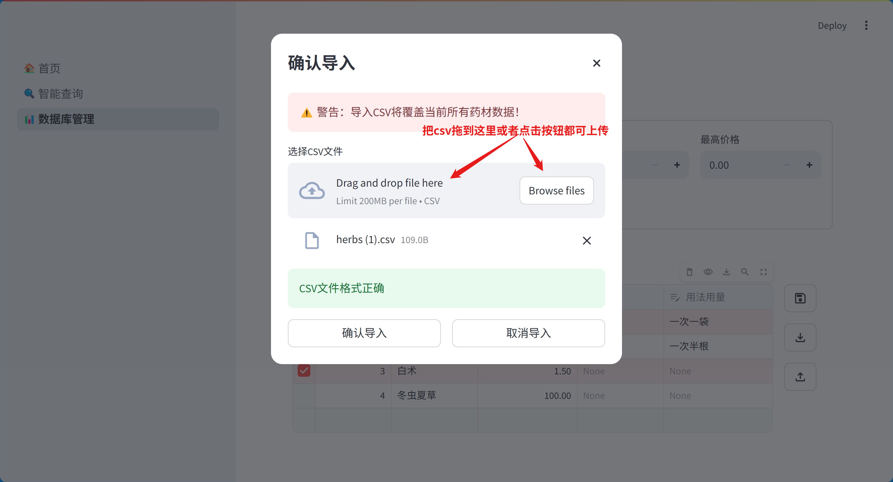
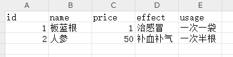

# HerbStat

一个简单的中药数据库管理系统
- 基于DeepSeek进行智能检索及药材总价计算等工作
- 基于sqlite的单表数据库管理
- 支持传统的数据库管理界面

## 使用说明

### 智能查询

基于当前数据库，以问答形式检索数据，并支持简单的价格计算功能
你可以这样提问：

- 板蓝根多少钱一克？
- 人参的功效是什么？
- 3克板蓝根，2克大黄一共多少钱？

当然也可以闲聊就是了~

### 数据库管理

支持以传统方式查询和修改数据库内容

#### 查询

第一次运行时默认的“药材数据”表格为全量数据库内容，可以通过药材ID、药材名称、价格等对药材数据进行检索，检索结果会记录在“药材数据”表格中

#### 修改

**注意：所有修改（增加、修改、删除）都必须点击右侧保存按钮方能生效，否则页面刷新后修改将失效！**

- 增加：点击表格下方空白行加号，即可增加新的药材数据
  - 药材ID：自动生成，不需填写
  - 名称：必须填写字符
  - 价格/克：必须填写数字
  - 功效 & 用法用量：可选
- 修改：直接修改对应行数据即可
- 删除：点击每行最左边可以选中该行，至少有一行被选中时，将鼠标指向表格，右上角会出现工具栏，点击垃圾桶按钮即可删除

#### 上传/下载表格

使用右侧的上传/下载按钮可以以csv格式上传/下载当前数据库数据。如果有批量修改的需要或者不习惯使用在线的修改界面，可以利用这项功能来修改数据。

- 下载：点击后弹出下载对话框，点击“下载CSV文件”即可以csv格式导出当前的全量数据（可用excel等软件对csv表格内容进行修改）
- 上传：点击上传按钮弹出上传对话框，将修改好的csv文件拖到“Drag and drop file here”区域，或点击“Browse files”按钮选择csv文件。确认CSV文件格式正确后，会出现“确认导入”按钮，点击即可导入csv文件并覆盖当前的数据库

**注意：导入csv文件将会导致整个数据库被覆盖，请谨慎操作避免数据丢失！**

csv表格格式如下：
- id：自动生成，不用管，但需要注意不能重复
- name：药材名，必须填写
- price：价格，必须填写
- effect：功效，可选
- usage：用法用量，可选

**注意：只能修改数据部分，不能修改表头（即第一行）否则无法通过格式检查

